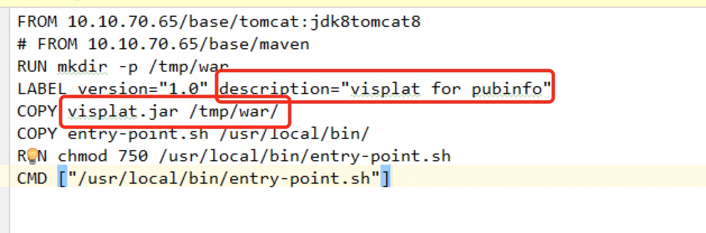

# Jenkins持续集成
## 1.Jenkinsfile文件的编写
  1.jenkinsfile头部定义项目的有关信息

  

  2.填写相关的kubernetes的pod需要分配的资源信息，挂载盘等。

  

  3.填写相关的jenkins的pipeline信息，pipeline以stage来区分构建流程，每一个stage是一个步骤。

  -构建容器
  -1.生成流水线脚本并填写(从jenkins中获取或联系ops获取)
  获取步骤：
  
  点击流水线脚本，进入流水线脚本页面后填写相关信息。
  
  点击流水线生成后填入Jenkinsfile中。
  
  -2.配置相应的项目镜像搭建步骤:
  <1>ng/ionic build: 对目标前端文件夹进行授权，进入前端项目文件夹，构建前端项目，开发人员要进行build命令的测试确保项目无错，代码错误与引用错误都会停止打包。
  <2>build a maven project:进行后端java项目的打包，开发人员要进行mvn相关打包的测试确保项目无错，jar包冲突，代码的一些错误会停止打包。
  <3>sonarqube analysis:代码质量检查，运用alibaba p3c空间进行代码的扫描，后期会将代码质量也重视起来。（可配）
  <4>build a docker image:构建docker镜像。
  <5>push docker image:将构建的镜像传入dockerhub中。
  ps：目前开发人员只需要修改头部项目信息，流水线脚本信息以及项目构建的前后端stage部分。
## 2.Dockerfile文件的编写
  注：首先要确定是否要部署在线的单点登录，jwt，权限系统等依赖系统，是否切数据库等，如需切换，将打好的war包交与ops人员。
  Dockerfile包括两部分，第一部分是dockerfile，是启动docker容器时执行的docker流程，第二部分是启动docker容器要执行的替换变量和具体启动tomcat等容器的命令。
  1.docekrfile：dockerfile主要是docker容器启动时的操作，拉取基础镜像，启动docker容器等，开发人员需要确定自己的项目包正确。
  
  
  2.entry-point：该文件是docker镜像启动时的具体操作，主要操作时对项目包的解压，替换变量，压缩，启动容器等。
  entry-point文件中需要将war包运行的文件夹修改为自己项目中的，并且将web.xml中的单点登录，jwt和前端配置的用户权限，jwt替换为58服务器，在58服务器中由ops人员做反向代理，
  转发到目标服务器，数据库如果需要切换，也需要替换。
  war包
    
    
    
  jar包
  
  

