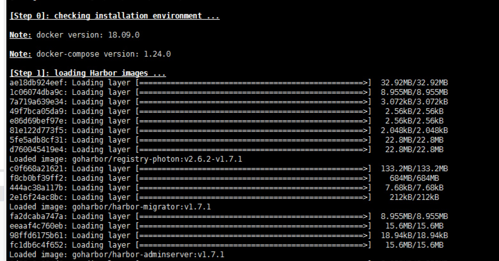
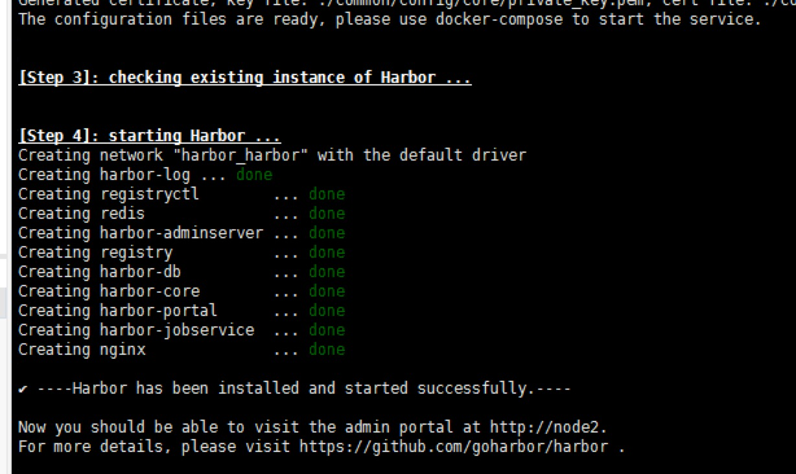
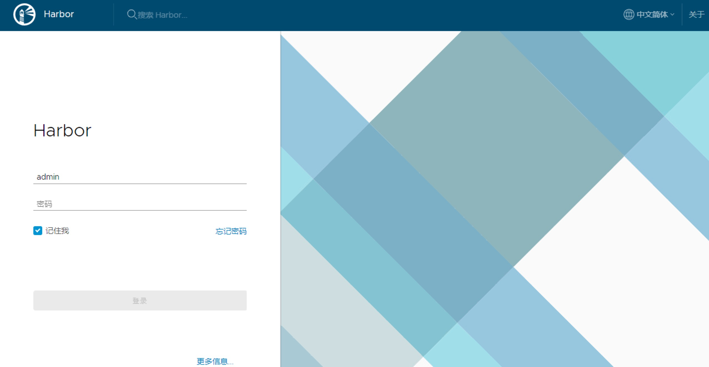
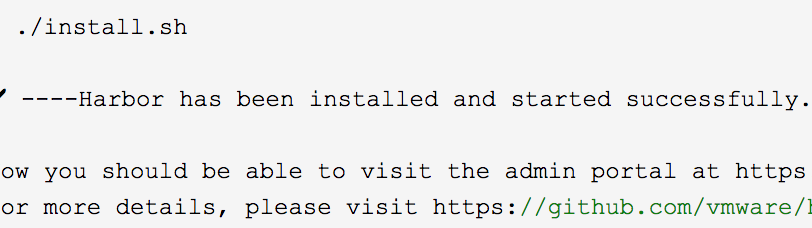

##### 前置：安装harbor需要对docker registry仓库有简单了解，harbor是实现了多租户模式的分布式镜像管理工具，包含了docker镜像仓库，此工具使用shell脚本安装，需要提前下载镜像包，并且安装docker-compose编排工具。

# Harbor的安装与部署

环境：centos7.4

因为在内网中，所以统一使用离线包进行安装。

harbor需要依赖docker-compose来启动。

研发人员需要准备两个包：docker-compose和docker-harbor。

### docker-compose的安装

docker-compose是一个docker轻量级的编排(@1)工具，只需要下载它的运行文件。

地址：`https://github.com/docker/compose/releases`(因为在github中，请提前下载并且选择对应版本)

下载完成后将其拷入命令集中。

`cp docker-compose /usr/local/bin/docker-compose`

授予执行权限

`chmod +x /usr/local/bin/docker-compose`

ps：网上的命令讲解

`curl -L https://github.com/docker/compose/releases/download/1.16.1/docker-compose-`uname -s`-`uname -m`-o /usr/local/bin/docker-compose`

从github中下载 -s 减少输出信息，-o 输出，-L跟随链接重定向

可选：`yum install bash-completion` bash命令补全

`docker-compose --version` 

安装成功～

卸载：`rm  /usr/local/bin/docker-compose`

 

## Harbor安装

准备好offline安装包,开始安装

```
# cd /usr/local/src/
# tar zxf harbor-online-installer-v1.2.0.tgz  -C /usr/local/
# cd /usr/local/harbor/
```

修改harbor目录下的harbor.cfg文件

```
# vim /usr/local/harbor/harbor.cfg
hostname = 
#邮箱配置 按照个人需求配置
email_server = 
email_server_port = 
email_username = 
email_password =
email_from = UnixFBI <>
email_ssl = false
#禁止用户注册
self_registration = off
#设置只有管理员可以创建项目
project_creation_restriction = adminonly
```

 

执行安装脚本

`/usr/local/harbor/install.sh`

此脚本可以将下载的离线镜像包倒入当前docker节点并且启动docker-compose.yml将harbor启动。

开始会加载镜像，由于镜像包都已经离线下载，只需要等待即可。

安装完成后执行命令`docker ps`就可以看到启动的harbor镜像，镜像是使用docker-compose部署，相关信息可以查看目录下的docker-compose.yml文件。





这时项目已经启动

 

harbor的日常启动关闭命令：

```
启动Harbor
# docker-compose start
停止Harbor
# docker-comose stop
重启Harbor
# docker-compose restart
```

 

 使用docker-compose管理。

这时可以访问harbor页面来查看。

浏览器输入部署地址，例：10.10.70.214 。



测试账号:test02/Ll23456

 

附加：如果需要https进行访问

需要安装openssl服务。

修改harbor.cfg的默认访问方式

```
hostname = rgs.unixfbi.com
ui_url_protocol = https
ssl_cert = /etc/certs/ca.crt
ssl_cert_key = /etc/certs/ca.key
```

创建自签名证书：

```
mkdir /etc/certs
openssl genrsa -out /etc/certs/ca.key 2048 
Generating RSA private key, 2048 bit long modulus
....+++
..................................................+++
e is 65537 (0x10001)
```

 

```
openssl req -x509 -new -nodes -key /etc/certs/ca.key -subj "/CN=自己的仓库域名" -days 5000 -out /etc/certs/ca.crt
```

在进行安装的时候就会显示https访问



客户段连接仓库时需要配置：

```
mkdir -p /etc/docker/certs.d/域名
# -p 创建多级目录
```

使用scp或者rz将服务端创建的cert证书文件拷入该目录下，加载配置文件重启docker服务（在docker安装篇有），就可以使用docker login命令登录了，注意将仓库地址加入docker白名单。

无论是使用http/https，客户端与服务端的方式需要统一，否则会出现错误。

```
Error response from daemon: Get https://10.10.70.214/v1/_ping: dial tcp 10.10.70.214:443: getsockopt: connection refused
```

 

 