## harbor简介与使用

##### 简介：harbor是vmware开源的一款企业级docker registry，通过添加一些企业必需的功能特性，例如安全、标识和管理等，扩展了开源Docker Distribution。作为一个企业级私有Registry服务器，Harbor提供了更好的性能和安全。提升用户使用Registry构建和运行环境传输镜像的效率。Harbor支持安装在多个Registry节点的镜像资源复制，镜像全部保存在私有Registry中， 确保数据和知识产权在公司内部网络中管控。另外，Harbor也提供了高级的安全特性，诸如用户管理，访问控制和活动审计等。

##### harbor的特性

- **基于角色的访问控制** ：用户与Docker镜像仓库通过“项目”进行组织管理，一个用户可以对多个镜像仓库在同一项目（project）里有不同的权限。
- **镜像复制** ： 镜像可以在多个Registry实例中复制（同步）。尤其适合于负载均衡，高可用，混合云和多云的场景。
- **图形化用户界面** ： 用户可以通过浏览器来浏览，检索当前Docker镜像仓库，管理项目和命名空间。
- **AD/LDAP 支持** ： Harbor可以集成企业内部已有的AD/LDAP，用于鉴权认证管理。
- **审计管理** ： 所有针对镜像仓库的操作都可以被记录追溯，用于审计管理。
- **国际化** ： 已拥有英文、中文、德文、日文和俄文的本地化版本。更多的语言将会添加进来。
- **RESTful API** ： RESTful API 提供给管理员对于Harbor更多的操控, 使得与其它管理软件集成变得更容易。
- **部署简单** ： 提供在线和离线两种安装工具， 也可以安装到vSphere平台(OVA方式)虚拟设备。

### harbor的使用

默认harbor搭建完成，docker可以连接harbor仓库，并登陆成功。

#### harbor登录

成功打开web harbor页面，如果http登录，保证80端口未被占用。

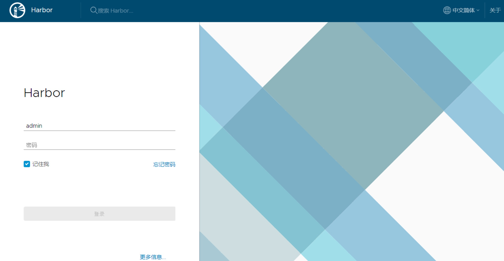

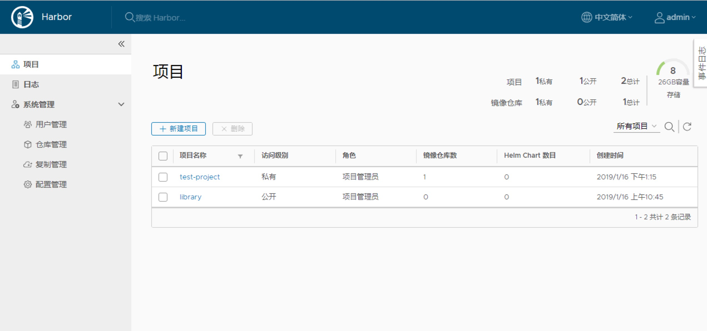

我们可以看到系统各个模块如下：

- 项目：新增/删除项目，查看镜像仓库，给项目添加成员、查看操作日志、复制项目等

- 日志：仓库各个镜像create、push、pull等操作日志

- 系统管理 

  -- 用户管理：新增/删除用户、设置管理员等

  -- 仓库管理：新增/删除从库目标

  -- 复制管理：新建/删除/启停复制规则等

  -- 配置管理：认证模式、复制、邮箱设置、系统设置等

- 其他设置 

   

  -- 用户设置：修改用户名、邮箱、名称信息

   

 

## 创建项目

harbor中每一个用户创建的项目都有独立的镜像权限，项目可以设置为公有或私有，library是初始的默认的公有项目，所有用户都可以访问，可以类比github中的私仓与公仓。

创建项目：

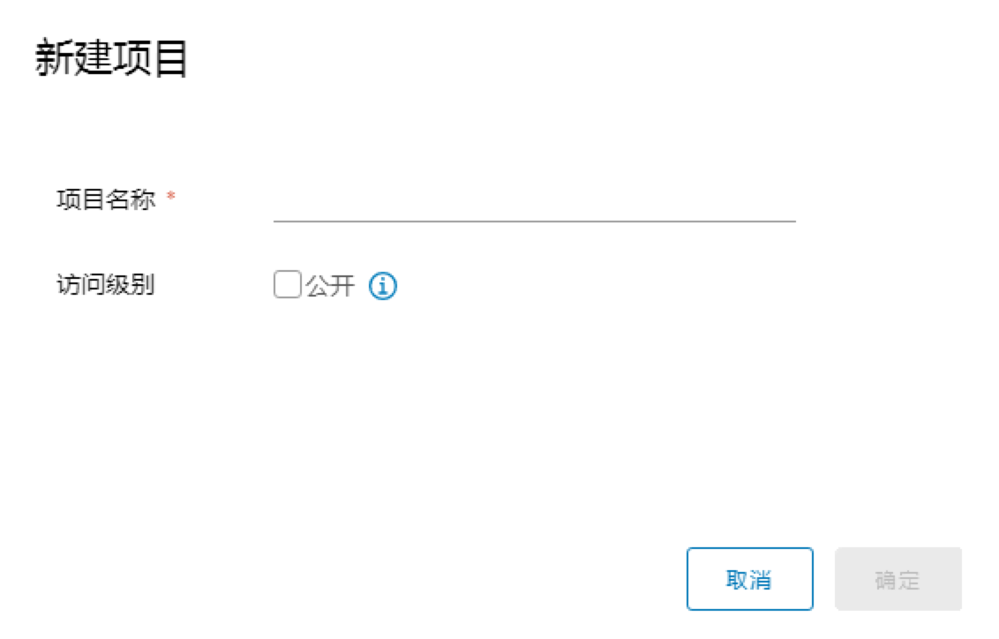

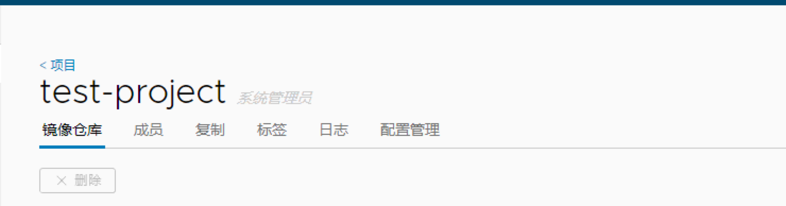

项目的权限分配：

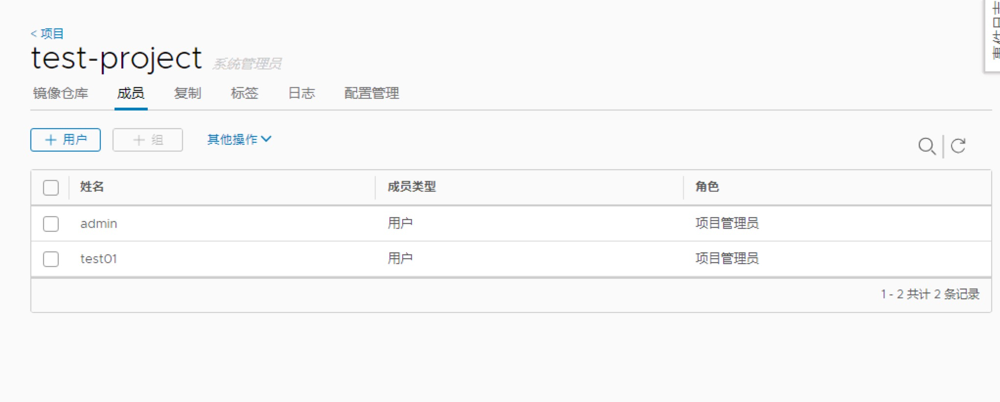

项目管理员：读写权限，同时拥有用户管理/镜像扫描等管理权限

开发人员：对于指定项目拥有读写权限

访客：对于指定项目拥有只读权限

 

## 推送镜像

 

向指定的仓库中推送镜像。在指定的项目中点击推送镜像会弹出相应的命令，到推送镜像的docker节点上执行命令，将命令中的镜像和版本填写完整，

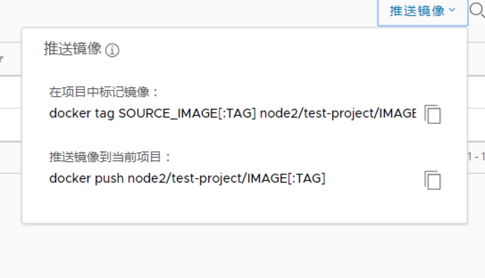

 

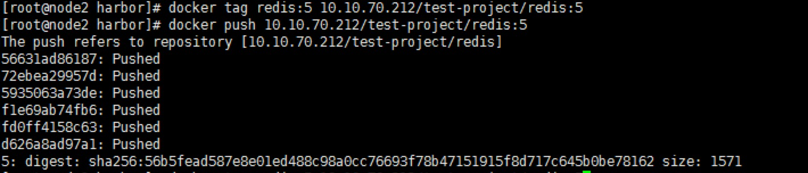

推送时一定要把域名换为http地址，否则可能不成功。

 

### 项目权限分离

每个仓库设置不同的成员，每个成员登录后都有不同的权限，可以看到不同的项目，但是可以看到公仓，所以基础镜像可以放到公仓中，各团队有着不同的项目权限，每个人又有不同的项目角色，结合harbor可以实现多租户场景。

用户管理：

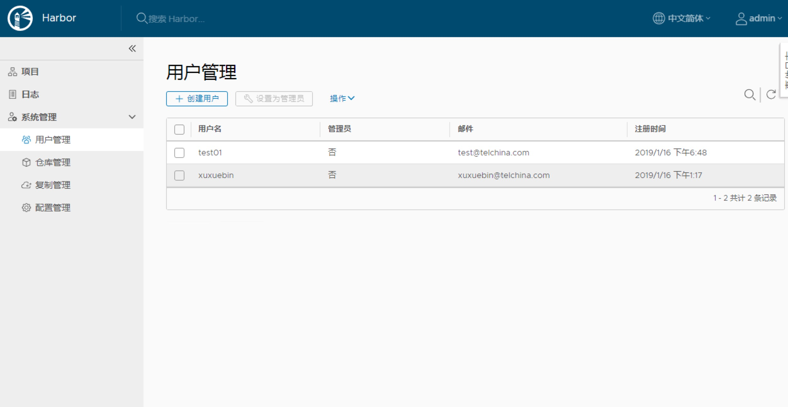

以test-project项目为例：

它的成员为管理员与test01用户。

test01用户的页面：

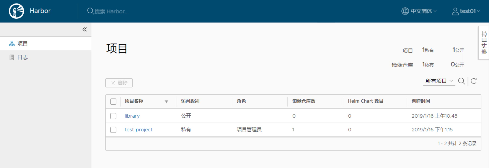

可以看到该项目，其他用户不可见。

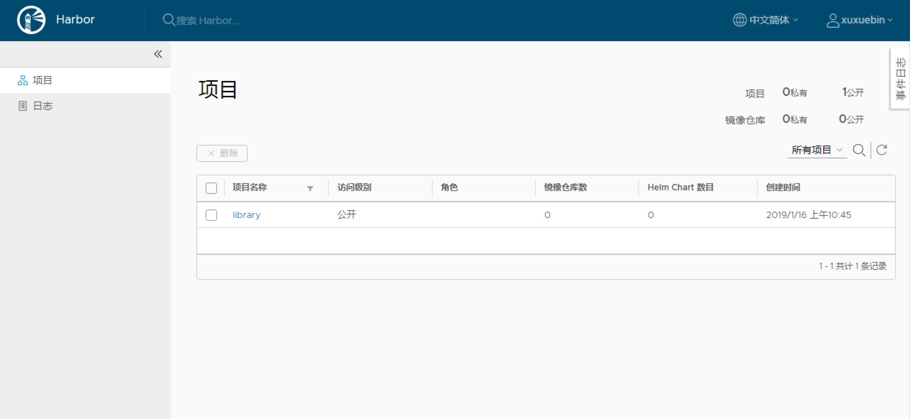

 

借用一张图片

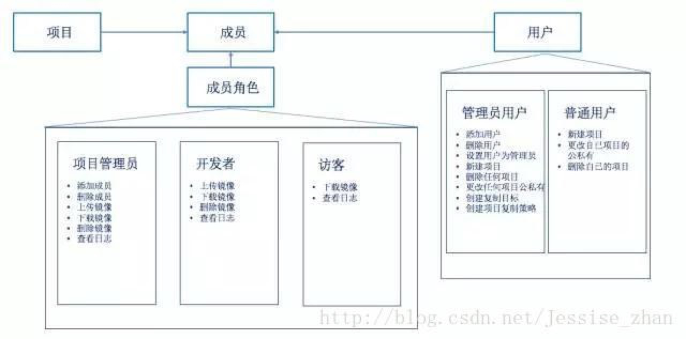

harbor的仓库同步

一般在上云时，为了保证高可用与便利性，会搭建docker的仓库集群。

镜像仓库有多级规划，下级仓库依赖上级仓库 
更常用的场景是，在企业级软件环境中，会在软件开发的不同阶段存在不同的镜像仓库， 
在开发环境库，开发人员频繁修改镜像，一旦代码完成，生成稳定的镜像即需要同步到测试环境。 
在测试环境库，测试人员对镜像是只读操作，测试完成后，将镜像同步到预上线环境库。 
在预上线环境库，运维人员对镜像也是只读操作，一旦运行正常，即将镜像同步到生产环境库。 
在这个流程中，各环境的镜像库之间都需要镜像的同步和复制。

这个可以使用harbor的复制规则来实现，现在涉及不多，所以简单介绍。

仓库管理页面中可以添加要纳入的仓库：

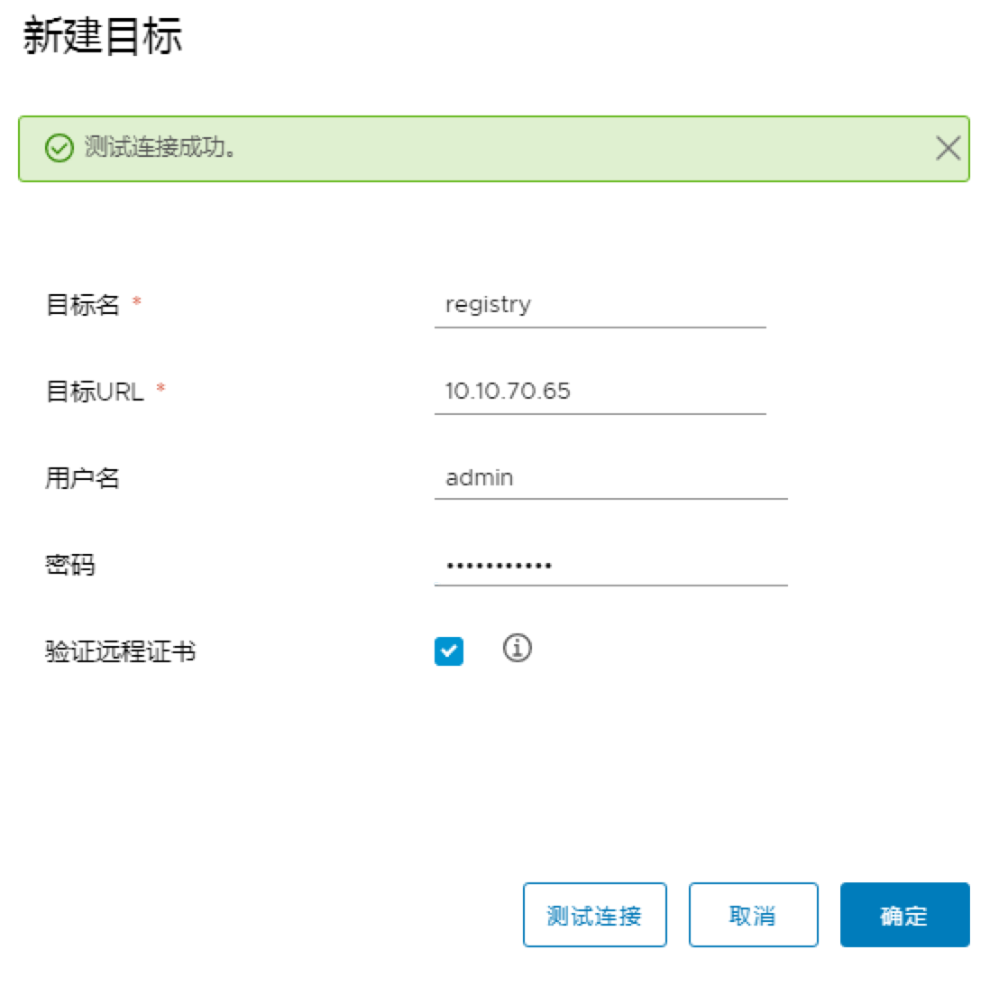

可以使用http/https，在上一篇中有介绍。

添加仓库后

进入复制管理页面新建复制规则：

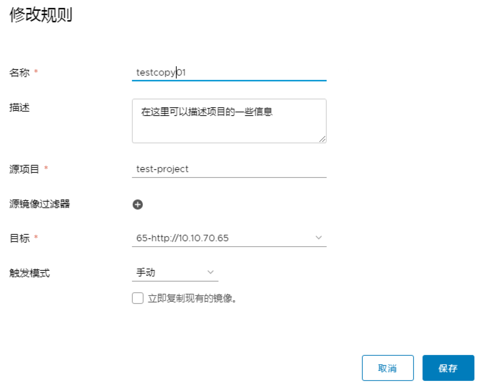

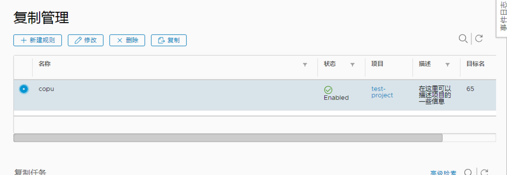

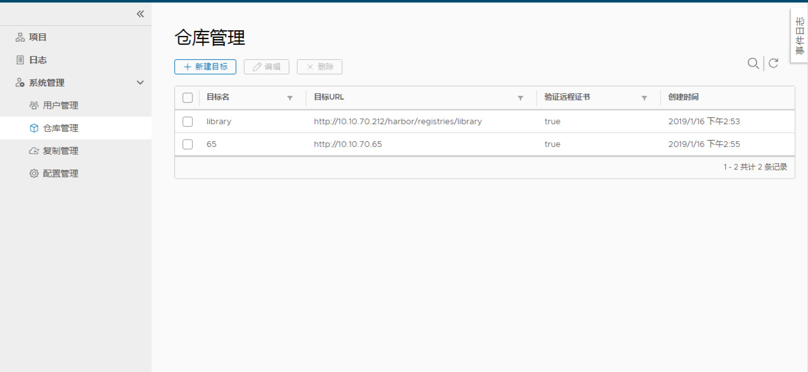

在每个项目中都可以建立自己的复制规则。

可以有定时，即刻，和手动三种方式。

这样就可以完成主从同步等仓库需求。

在实际的企业级生产运维场景，往往需要跨地域，跨层级进行镜像的同步复制，比如集团企业从总部到省公司，由省公司再市公司的场景。

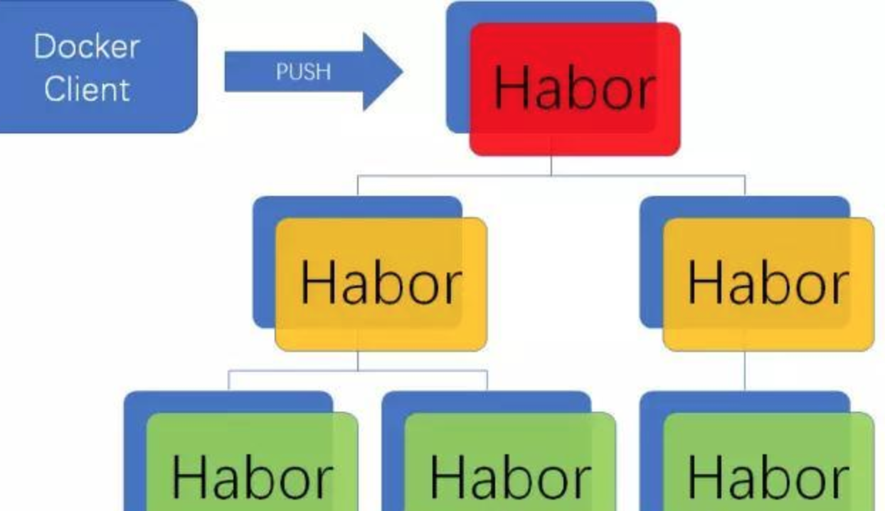

从一个harbor到更多的harbor。