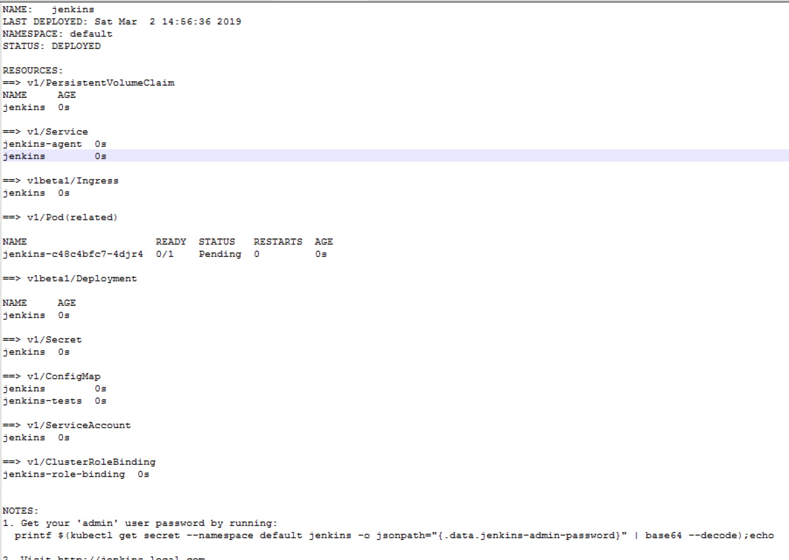

##### helm的介绍

Helm 致力于成为k8s集群的应用包管理工具，希望像linux 系统的`RPM` `DPKG`那样成功；确实在k8s上部署复杂一点的应用很麻烦，需要管理很多yaml文件（configmap,controller,service,rbac,pv,pvc等等），而helm能够整齐管理这些文档：版本控制，参数化安装，方便的打包与分享等。

- 建议积累一定k8s经验以后再去使用helm；对于初学者来说手工去配置那些yaml文件对于快速学习k8s的设计理念和运行原理非常有帮助，而不是直接去使用helm，面对又一层封装与复杂度。

使用Helm可以在kubernetes集群中部署复杂的应用，并且可以从网上下载已经整理好的复杂应用的chart文件进行部署，而不需要自己编写kubernetes的资源yaml文件，按照需求修改value.yaml即可。

##### helm的安装

详见[kubernetes的相关组件的搭建](../kubernetes/kubernetes相关周边组件搭建.md)。

##### helm的使用

因为环境是在内网环境，所以部署项目首先要根据`value.yaml`文件中的镜像列表拉取到本机绑定的docker仓库中，将镜像列表替换为仓库中可访问的镜像，配置为内网安装。

现在并没有深入使用helm去集成kubernetes的持续发布，所以只是介绍简单命令，更多请参考官网。

#### helm的常用命令

查看已经部署的项目:

`helm ls`  或 `helm list`

部署项目：

`helm install --namespace cicd --name spinnaker2 ./spinnaker/ `

部署项目在k8s集群，选择命名空间，chart文件的目录。

删除部署的项目：

`helm delete name ` 或者 `helm delete name --purge`

更新chart列表：

`helm repo update`

helm部署完毕后会返回相应的部署信息与状态。

